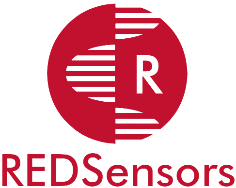

<p align="center">

</p>
<hr>
<h1 align="center">Sistema REDSensors - Frontend Web</h1>
<h2 align="center">Desarrollo de Software Avanzado</h2>
<h3 align="center">Máster Universitario en Desarrollo Ágil de Software para la Web</h3>
<h4 align="center">Universidad de Alcalá</h4>
<h5 align="center">Curso 2021-2022</h5>
<h6 align="center" style="font-style: italic">Christian Dopico, David Abarca, Jorge Romero, Justin Hernández, Williams Rodríguez</h6>
<hr>

<!-- ÍNDICE -->

<details open="open">
	<summary>Índice</summary>
	<ol>
		<li>
			<a href="#about-the-project">El proyecto</a>
		</li>
        <li>
			<a href="#about-the-project">Diseño</a>
			<ul>
                <li><a href="#built-with">Stack</a></li>
				<li><a href="#built-with">Arquitectura frontened</a></li>
                <li><a href="#built-with">Interfaz</a></li>
			</ul>
		</li>
		<li>
			<a href="#getting-started">Como empezar</a>
			<ul>
				<li><a href="#prerequisites">Requisitos previos</a></li>
				<li><a href="#installation">Instalación</a></li>
			</ul>
		</li>
		<li><a href="#license">Licenciamiento</a></li>
		<li><a href="#contact">Contacto</a></li>
	</ol>
</details>

<!-- EL RPOYECTO -->

# El proyecto


Demo del Proyecto: [Web REDSensors](https://uah-frameworks-frontend-trabajo-final-vue-giodimagio.vercel.app/) (desplegado con [...]())

<!-- DISEÑO -->
# Diseño

En esta sección se listan las tecnologías, frameworks, librerías y otras herramientas o recursos relevantes usados para la realización del proyecto.

## Stack

#### Tecnologías:

* [HTML5](https://html5.org/), [CSS3](https://www.w3.org/TR/CSS/#css), [JavaScript ES6](https://262.ecma-international.org/6.0/)

#### Framework JS:

* [React 17](https://es.reactjs.org/blog/2020/10/20/react-v17.html)

#### Framework CSS:

* [Bootstrap 5](https://getbootstrap.com/docs/5.0/getting-started/introduction/)

#### Librerías:

* [Axios](https://axios-http.com/docs/intro)
* [Google Maps React](https://www.npmjs.com/package/google-maps-react)

#### Otros recursos:

* [VSCode](https://code.visualstudio.com/)
* [npm](https://jquery.com)
* [Git](http://git-scm.com/)
* [GitHub](https://github.com/)
* [Markdown](https://jquery.com)

## Arquitectura frontend
## Interfaz

<!-- COMO EMPEZAR -->

# Como empezar

En esta sección se listarán los pasos necesarios para obtener una copia local del proyecto y ejecutarlo en modo desarrollo.

## Requisitos previos

Previamente, debemos tener instalado lo siguiente:

* Un editor de código. Para desarrollo web con React lo más recomendable es usar **VSCode**, al cual se pueden añadir extensiones específicas para dicho framework desde el [Marketplace](https://marketplace.visualstudio.com/search?term=react&target=VSCode&category=All%20categories&sortBy=Relevance).

* **Node.js**. Es necesario para poder ejecutar código javascript fuera del navegador, con [npm](https://www.npmjs.com/) como gestor de paquetes y librerías incorporado. Es posible utilizar otros gestores como [yarn](https://yarnpkg.com/).

## Instalación

1. Abrimos un terminal y clonamos el repositorio desde [GitHub](https://github.com/chrisdopico/proyecto-dsa-frontend), vía HTTPS o SSH:

    HTTPS
   ```sh
   git clone git@github.com:chrisdopico/proyecto-dsa-frontend.git
   ```
 	SSH
   ```sh
   git clone https://github.com/chrisdopico/proyecto-dsa-frontend.git
   ```
2. Nos movemos a la carpeta del proyecto, e.g.:
   ```sh
   cd ~/gitProjects/uah/desarrollo-software-avanzado/proyecto-dsa-frontend
   ```
3. Instalamos las dependencias que aparecen en el **package.json** mediante el comando
   ```sh
   npm install
   ```
4. Ejecutamos el siguiente comando para lanzar el servidor de desarrollo de React, por defecto se iniciará en http://localhost:3000/
   ```sh
   npm start
   ```

<!-- LICENCIAMIENTO -->

# Licenciamiento

Distribuido bajo la licencia MIT

<!-- CONTACTO -->

# Contacto

Williams Rodríguez: (Desarrollador web) - [williams.rodriguez@edu.uah.es](williams.rodriguez@edu.uah.es)

Justin Hernández (Arquitectura y Backend) - [justin.hernandez@edu.uah.es](justin.hernandez@edu.uah.es)

Jorge Romero (Responsable de proyecto) - [jorge.romeroc@edu.uah.es](mailto:jorge.romeroc@edu.uah.es)

David Abarca (Diseño Bases de datos) - [david.abarca@edu.uah.es](david.abarca@edu.uah.es)

Christian Dopico (Desarrollador móvil Android) - [chrisitian.dopico@edu.uah.es](chrisitian.dopico@edu.uah.es)